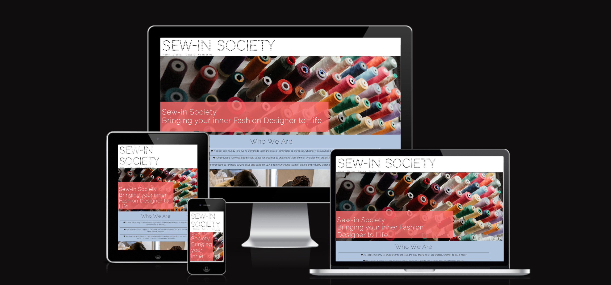
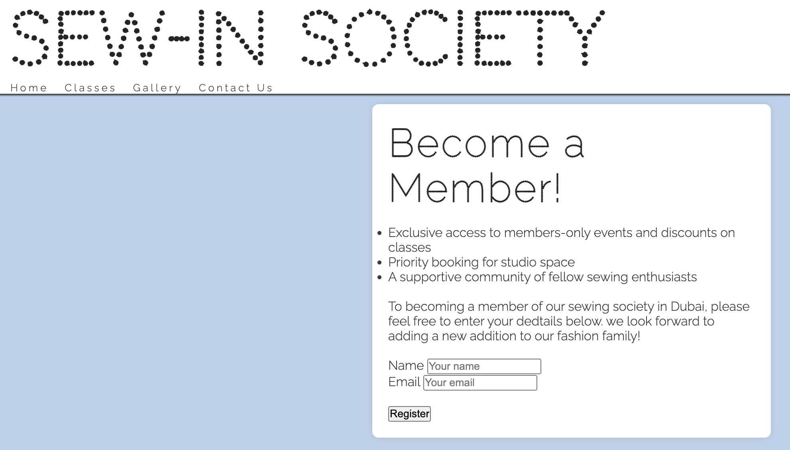
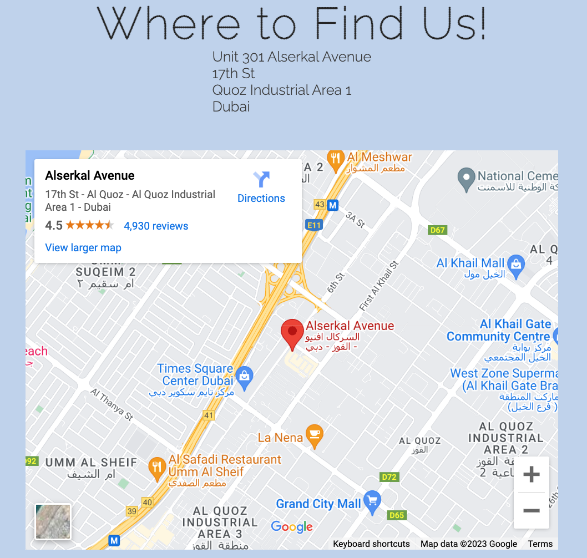
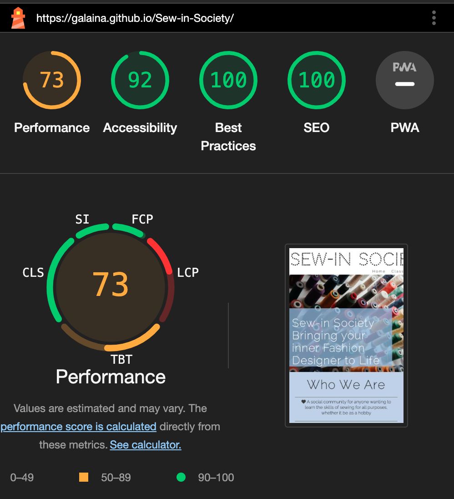
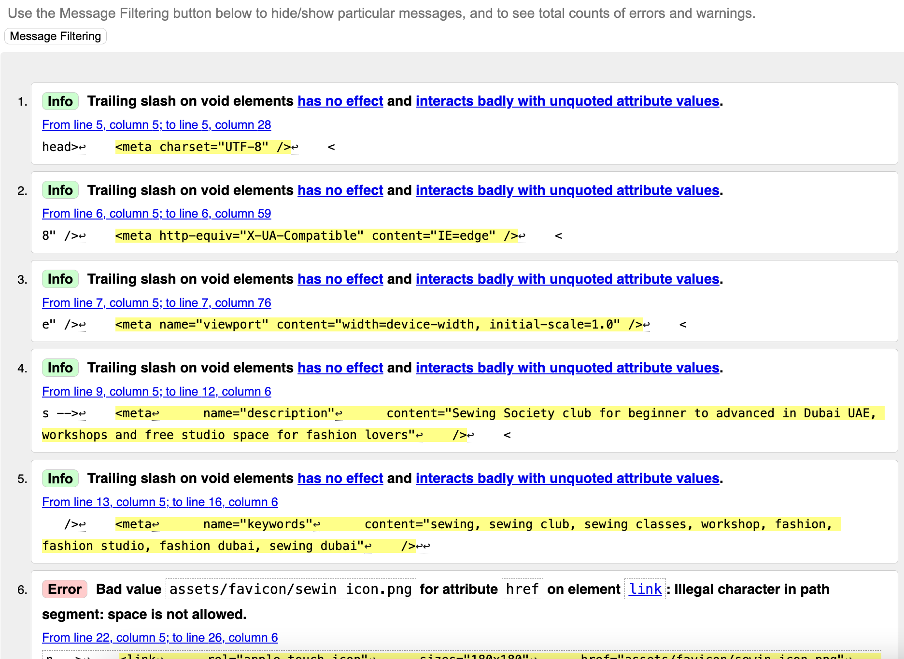
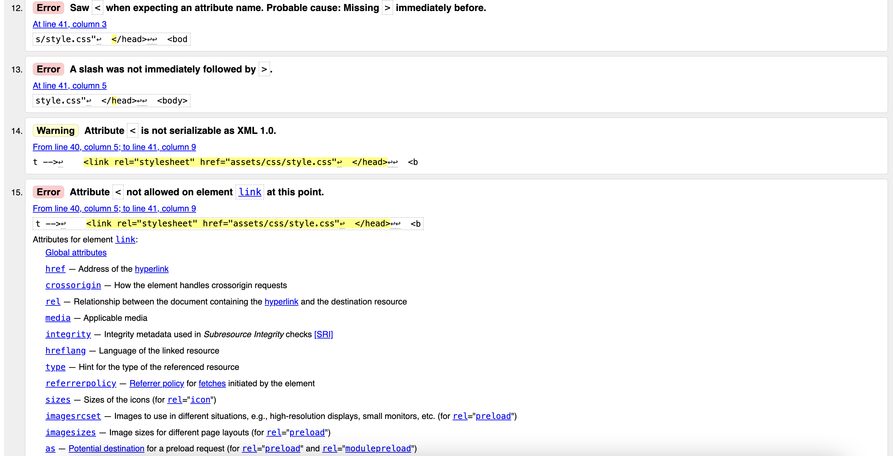
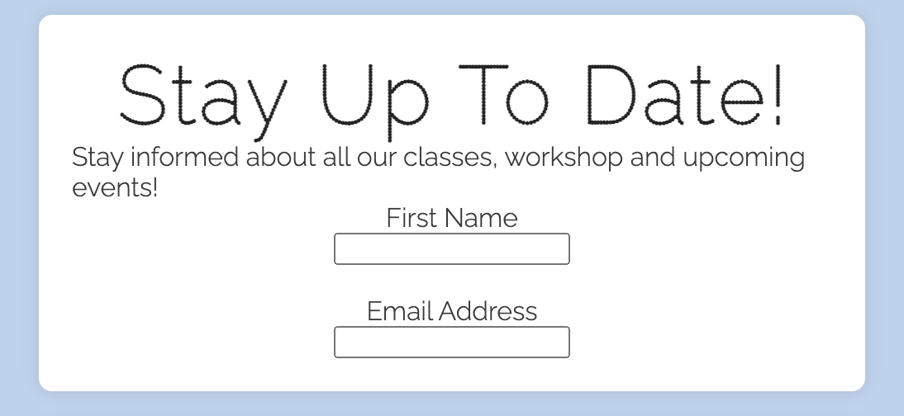
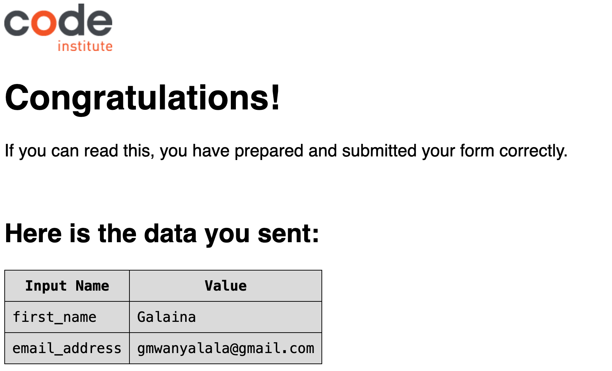
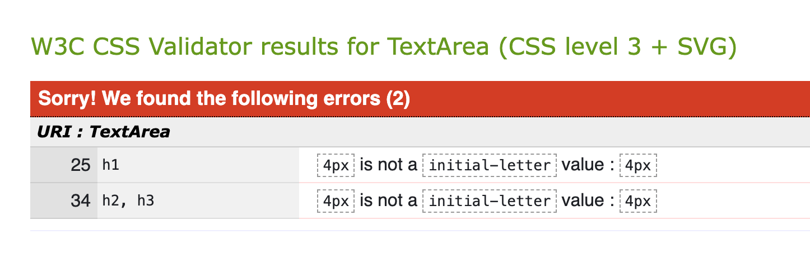

# Sew-In Society

Welcome to the Sew-In Society website! This platform is designed to provide a seamless experience for users interested in sewing and and pattern cutting, including testimonials from the team, imagery gallery of the community and links to social media platforms. Whether you're a seasoned professional or just starting, our website aims to connect and inspire the sewing community by inviting them to our fully equipped sewing studio with professional assistance at hand.

## Features

### Navigation

The website boasts an intuitive and user-friendly navigation system. The menu is organized logically, making it easy for users to explore various sections, including classes, gallery, and a contact page.

### Hero Image and Cover-Text

The captivating hero image and cover-text provide an engaging visual experience. It sets the tone for the website and showcases the creativity of the sewing community. It also plays as a snippet introduction to all the pages, giving a brief overview.

### Sign-Up Form

To enhance user engagement, i have offered a simple and secure sign-up form. Users can sign up to stay up to date with all events and upcoming workshops. They also have the option to become a member create accounts to access exclusive content, priority bookings to all events, and being a part of a growing thriving community of like minded creatives.

### Gallery

The gallery page allows users to get a visual representation of the studio space and the community. it showcases the workspace, free facilities and environment they would work in.

[gallery page](documentation/feature_5.png)

### Google Map

The interative google map allows users toget accurate location from a trusted source to find the studio. can be used to find direction via car, public transport or by foot.

## User Experience (UX)

### User Stories

First Time User

- As a First Time Visitor, they will want to easily understand the purpose of the site and learn more about the company.
- As a First Time Visitor, they will want to easily navigate the way through the site with clear indications to the right pages
- As a First Time Visitor, they will want to discover the benefits of joining the Sewing Society Club

Returning User

- As a Returning Visitor, they will want to read further on the team member testimonials and classes details
- As a Returning Visitor, they will want to easily sign up for access exclusive updates to events and workshops
- As a Returning Visitor, they will want to explore all features in depth including the social media links to gain more insght into the sew-in society community

Frequent User

- As a Frequent Visitor, they will want to easily sign up for membership to access all member benefits such as priority workshop booking, discounted and free events
- As a Frequent Visitor, they will want to copy and share the key contact details with other networks, such as the address and email

### Design

Colour Scheme

- The two main colours used are lightsteel blue for the background, and white for the header, footer and some text .

Typography

- The Raleway font is the main font used throughout the whole website with Sans Serif as the fallback font in case for any reason the font isn't being imported into the site correctly. also the Raleway Dots font was a family font used for all headings that gave more texture. Raleway group font is a clean font and suitable in programming, so it is both attractive and appropriate.

Imagery

- Imagery is important. The large, background hero image is designed to be striking and catch the user's attention. It also has a vibrant and aesthetically clean image that aligns with the theme of the site.

## Testing

The W3C Markup Validator and W3C CSS Validator Services were used to validate every page of the project to ensure there were no syntax errors in the project.

- [W3C Markup Validator](https://jigsaw.w3.org/css-validator/#validate_by_input) - [Results](https://github.com/)
- [W3C CSS Validator](https://jigsaw.w3.org/css-validator/#validate_by_input) - [Results](https://github.com/)

Accessibility testing run via lighthouse has shown that my fonts and colours are easy to read and accessible for all users. please see the results shown below.

### Solved Bugs

When running my deployed website home page through th Markup Validator, I discovered some broken codes that were disrupting the efficiency of my site. The below examples show some common errors

I returned to my index.html and resolved these issues by structuring the broken codes correctly

The submit button was not visible in th esign up box and either submit button were working correctly

I returned to the contact.html and notice the form element was not structured correctly, as the closing backets were at the end of the form content. i restructured the code and now the completed sign up page appears after all information is entered correctly

### Further Testing

The Website was tested on Google Chrome, Firefox and Safari browser.
The website was viewed on a different devices such as Desktop, Laptop and latest iPhone models
A large amount of testing was done to ensure that all pages were linking correctly.

### Known Bugs

The imported stylesheet from googlefont can not be checked in direct input. however this is out of the developer control and dos not effect the fonts function on the website.

## Deployment

### GitHub Pages

The project was deployed to GitHub Pages using the following steps...

1. Log in to GitHub and locate the [GitHub Repository](https://github.com/)
2. At the top of the Repository (not top of page), locate the "Settings" Button on the menu.
   - Alternatively Click [Here](https://raw.githubusercontent.com/) for a GIF demonstrating the process starting from Step 2.
3. Scroll down the Settings page until you locate the "GitHub Pages" Section.
4. Under "Source", click the dropdown called "None" and select "Master Branch".
5. The page will automatically refresh.
6. Scroll back down through the page to locate the now published site [link](https://github.com) in the "GitHub Pages" section.

### Forking the GitHub Repository

By forking the GitHub Repository we make a copy of the original repository on our GitHub account to view and/or make changes without affecting the original repository by using the following steps...

1. Log in to GitHub and locate the [GitHub Repository](https://github.com/)
2. At the top of the Repository (not top of page) just above the "Settings" Button on the menu, locate the "Fork" Button.
3. You should now have a copy of the original repository in your GitHub account.

## Credit

- content was written by the developer.
- sought coding assistance from [w3schools]{<https://www.w3schools.com/>}

## Media

- images were downloaded from [pexels:]{<https://www.pexels.com/>}
- maps were imported from [Google Maps:]{<https://www.google.com/maps/>}
- Font Awesome was used on all pages throughout the website to add icons [Font Awesome:](https://fontawesome.com/)
- Google fonts were used to import the Raleway and Raleway Dots font throughout the website [Google Fonts:](https://fonts.google.com/)
